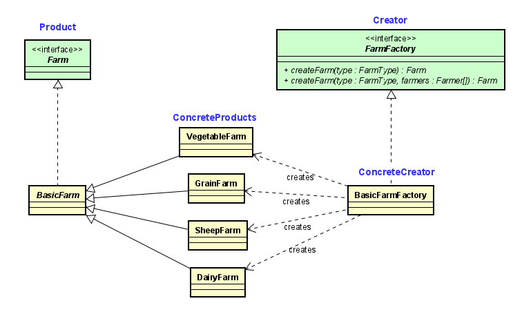

# Assignment 5  Design Patterns
# Tyler Filewich  tfilewic

## Submission A
I also want to have a short summary in the Readme.md on GitHub which explains your
rough idea for the Design Patterns you plan to implement (you can still change your mind
later). This can be very basic since we have not covered a lot about Design Patterns yet.
>The **DECORATOR** structural pattern can be applied to the following requirement:  *Similar to farmers, animals have affinities too (these are some examples to give you ideas): +
– A horse could be especially fast (higher chance for a person to win a race) 
– A cow may be larger than usual and produce more milk.
– A sheep may produce more woo*   This will allow animals to take on extra or enhanced functions, like producing extra milk or offspring.

>The **FACTORY** creational pattern can be applied to the following requirement:  *Farms can be of different types, such as an animal farm, a crop farm, a hybrid farm and so on. You can choose to make something up too.*   This will allow the various types of farms to be created from a single class.

>The **OBSERVER** behavioral pattern can be applied to the following requirement:  *Up to 6 farmers may start on a single farm with more farmers being hired every few cycles (this is your choice). Once a farm reaches its capacity of 10 farmers, then a new farm must be created by 3 of those farmers.*    This will allow the number of farmers on a farm to be monitored.  When it reaches 10, the observer class can perform the creation of the new farm.  

## Submission B

### Patterns Used

#### Factory Method

I chose this pattern because there can be a changing variety of Farm classes used in different ways, and I didn't want my Simulation to have to handle creating them directly.  Instead, I created the FarmFactory interface BasicFarm subclasses created so I want the FarmManager overrides this to perform application-specific steps after the object is instantiated, like adding the listenener.  The Design Patterns book describes an implementation that uses a parameterized factory method, and this is what I have used.

 