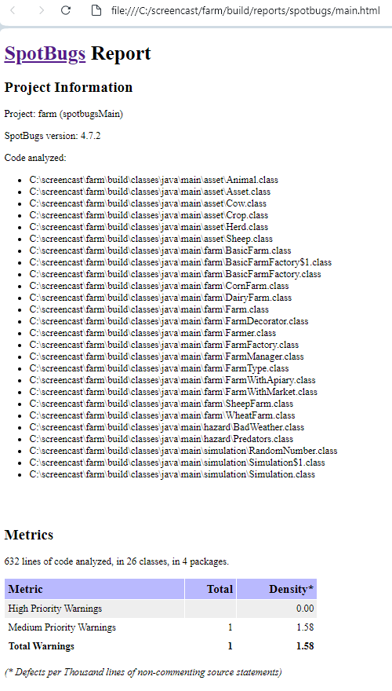
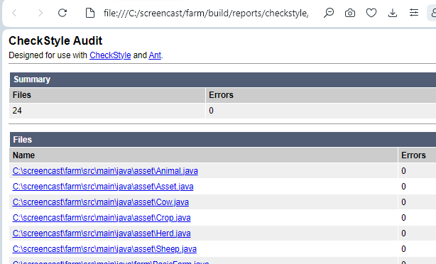
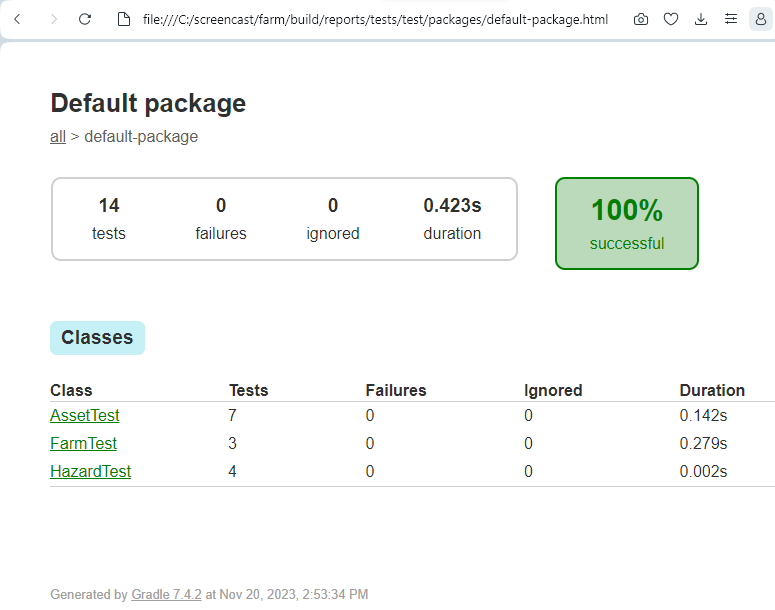
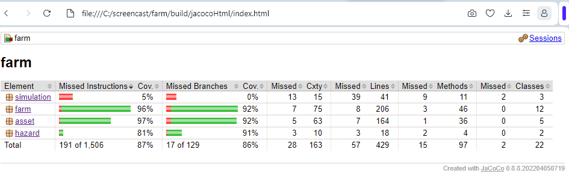

# Assignment 5  Design Patterns
# Tyler Filewich  tfilewic

# Submission A
I also want to have a short summary in the Readme.md on GitHub which explains your
rough idea for the Design Patterns you plan to implement (you can still change your mind
later). This can be very basic since we have not covered a lot about Design Patterns yet.
>The **DECORATOR** structural pattern can be applied to the following requirement:  *Similar to farmers, asset have affinities too (these are some examples to give you ideas): +
– A horse could be especially fast (higher chance for a person to win a race) 
– A cow may be larger than usual and produce more milk.
– A sheep may produce more woo*   This will allow asset to take on extra or enhanced functions, like producing extra milk or offspring.

>The **FACTORY** creational pattern can be applied to the following requirement:  *Farms can be of different types, such as an asset farm, a crop farm, a hybrid farm and so on. You can choose to make something up too.*   This will allow the various types of farm to be created from a single class.

>The **OBSERVER** behavioral pattern can be applied to the following requirement:  *Up to 6 farmers may start on a single farm with more farmers being hired every few cycles (this is your choice). Once a farm reaches its capacity of 10 farmers, then a new farm must be created by 3 of those farmers.*    This will allow the number of farmers on a farm to be monitored.  When it reaches 10, the observer class can perform the creation of the new farm.  

# Submission B

## Screencast
https://youtu.be/OPvCMagTSEw

## Patterns Used

### Factory Method

I chose this pattern because there can be a changing variety of Farm classes used in different ways, and I didn't want to have to anticipate which specific classes to create.  The Design Patterns book describes an implementation that uses a parameterized factory method, and this is what I used in the FarmFactory interface to create Farms of different FarmTypes.  This was then implemented by BasicFarmFactory for the BasicFarm subclasses.  

#### Requirements fulfilled:
• Farms can be of different types, such as an animal farm, a crop farm, a hybrid farm and so on. You can choose to make something up too. 

 

### Decorator
I chose this pattern because I wanted the ability to add additional functions to individual farms at runtime regardless of the specific farm class.  Instead of having to implement each additional function in every farm class and decided if they are enabled in each object, I can wrap any any Farm in any FarmDecorator.  This reduces repetition and allows the flexibility to add and remove functions, and create more decorators in the future.  The FarmDecorator abstract class both has a Farm and is a Farm.  It Overrides the update() method to call the original farm's update() as well as add its own code.  I implemented two concrete farm decorators for additional income, but more can be added. 

#### Requirements fulfilled:
• Farms can set up additional income streams, like partnering with a beekeeper or setting up shop at farmers markets.

### Observer
I chose this pattern because I have classes that must react to changes in others, but I did not want to tightly couple them because future versions could have different classes handling these events. It is used twice.  FarmManager observes BasicFarm, which notifies it when farmers >= 10 to create new farm.  Herd observes the Animal subclasses which notify it of births and deaths and adds or removes them from the herd accordingly.  More observers can be added in the future if other classes need to be updated.

#### Requirements fulfilled:
• Up to 6 farmers may start on a single farm with more farmers being hired every few
cycles (this is your choice). Once a farm reaches its capacity of 10 farmers, then a
new farm must be created by 3 of those farmers.  
• Animals have a chance to be born every 4 cycles (must have been alive at least 2
for the chance to occur).  
• Animals live for 14 days unless killed by a predator or they become diseased. 

## Reports

### Spotbugs

#### One warning:  DM_EXIT: Method invokes System.exit(...)
I want the program to exit normally when the simulation is over, and want to shut down the JVM, so I believe using System.exit[0] is appropriate here.

### Checkstyle

### junit

### jacoco

(All classes besides the main Simulation have >70% coverage)

## Requirements 
• A new world must start with at least 1 farm. 

• Farms can be of different types, such as an animal farm, a crop farm, a hybrid farm and so on. You can choose to make something up too. 

• The simulation should run on cycles. A cycle is considered to be of 2 parts - 1 day time and 1 night time.

 • Passive currency is earned with each new day (not night). This passive currency income is generated from selling crops or animal products, or both depending on your farm.

• Farms are automatically upgraded once the farm has acquired enough currency. This could mean that the farm is expanded to grant it more land, which allows it to hold a greater numbers of farmers, animals and crops. The upgrade may also increase the passive currency income. In order for the simulation to not run into issues, it might be a nice idea to make sure the farm only upgrades once your farm has acquired 20% (choose any % you like though) more than the cost of an upgrade. So, if an upgrade costs $1000, it will automatically upgrade at $1200 so the farm still has $200. 

• Up to 6 farmers may start on a single farm with more farmers being hired every few cycles (this is your choice). Once a farm reaches its capacity of 10 farmers, then a new farm must be created by 3 of those farmers. 

• Animal product (milk, wool, and so on) is replenished after every 2nd day during the day cycle. For example, if a sheep is sheared for its wool then the farmers must wait 2 cycles (day and night) to collect the wool again. 

 • During night cycles predators come out. – Predators could be foxes or wolves that may attack/eat the animals – Predators could also be rabbits or some other animal that eats crops – Predators could also be moles that damage the soil

 • During the day, products can be sold, new farms created, animals be born etc. Lets assume the positives happen during the day, the negative things in the night.

 • Animals have a chance to be born every 4 cycles (must have been alive at least 2 for the chance to occur). Alternatively, as an example, you could specify in your simulation that you wish to spend a certain percentage of your total currency every X number of cycles to buy more animals.

 • Animals live for 14 days unless killed by a predator. If killed by a predator they disappear in that same night.

• Animals have a natural life cycle just like in real life. They start as a baby where they cannot produce anything for the first 3 days (but may still be killed by predators and disease), and then after that they may produce until they die. 

 • Crops may be harvested 1 time every 3 cycles.

 • Farms can set up additional income streams, like partnering with a beekeeper or setting up shop at farmers markets.

This thing is going to be bigger than memoranda if I try to implement more of these…
