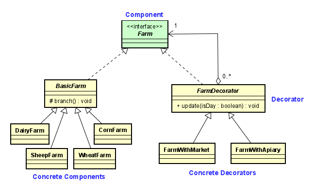

# Assignment 5  Design Patterns
# Tyler Filewich  tfilewic

# Submission A
I also want to have a short summary in the Readme.md on GitHub which explains your
rough idea for the Design Patterns you plan to implement (you can still change your mind
later). This can be very basic since we have not covered a lot about Design Patterns yet.
>The **DECORATOR** structural pattern can be applied to the following requirement:  *Similar to farmers, asset have affinities too (these are some examples to give you ideas): +
– A horse could be especially fast (higher chance for a person to win a race) 
– A cow may be larger than usual and produce more milk.
– A sheep may produce more woo*   This will allow asset to take on extra or enhanced functions, like producing extra milk or offspring.

>The **FACTORY** creational pattern can be applied to the following requirement:  *Farms can be of different types, such as an asset farm, a crop farm, a hybrid farm and so on. You can choose to make something up too.*   This will allow the various types of farm to be created from a single class.

>The **OBSERVER** behavioral pattern can be applied to the following requirement:  *Up to 6 farmers may start on a single farm with more farmers being hired every few cycles (this is your choice). Once a farm reaches its capacity of 10 farmers, then a new farm must be created by 3 of those farmers.*    This will allow the number of farmers on a farm to be monitored.  When it reaches 10, the observer class can perform the creation of the new farm.  

# Submission B

## Screencast

## Patterns Used

### Factory Method

I chose this pattern because there can be a changing variety of Farm classes used in different ways, and I didn't want to have to anticipate which specific classes to create.  The Design Patterns book describes an implementation that uses a parameterized factory method, and this is what I used in the FarmFactory interface to create Farms of different FarmTypes.  This was then implemented by BasicFarmFactory for the BasicFarm subclasses.  

#### Requirements fulfilled:
• Farms can be of different types, such as an animal farm, a crop farm, a hybrid farm and so on. You can choose to make something up too. 

 

### Decorator
I chose this pattern because I wanted the ability to add additional functions to individual farms at runtime regardless of the specific farm class.  Instead of having to implement each additional function in every farm class and decided if they are enabled in each object, I can wrap any any Farm in any FarmDecorator.  This reduces repetition and allows the flexibility to add and remove functions, and create more decorators in the future.  The FarmDecorator abstract class both has a Farm and is a Farm.  It Overrides the update() method to call the original farm's update() as well as add its own code.  I implemented two concrete farm decorators for additional income, but more can be added. 

#### Requirements fulfilled:
• Farms can set up additional income streams, like partnering with a beekeeper or setting up shop at farmers markets.

### Observer
I chose this pattern because I have classes that must react to changes in others, but I did not want to tightly couple them because future versions could have different classes handling these events. It is used twice.  FarmManager observes BasicFarm, which notifies it when farmers >= 10 to create new farm.  Herd observes the Animal subclasses which notify it of births and deaths and adds or removes them from the herd accordingly.  More observers can be added in the future if other classes need to be updated.

#### Requirements fulfilled:
• Up to 6 farmers may start on a single farm with more farmers being hired every few
cycles (this is your choice). Once a farm reaches its capacity of 10 farmers, then a
new farm must be created by 3 of those farmers.  
• Animals have a chance to be born every 4 cycles (must have been alive at least 2
for the chance to occur).  
• Animals live for 14 days unless killed by a predator or they become diseased. 

